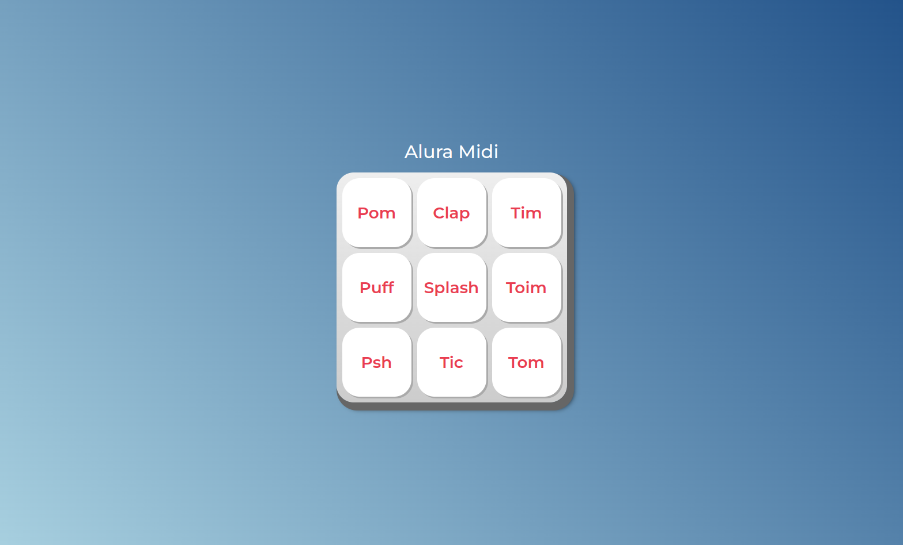

# Alura Midi

O Alura Midi é um instrumento musical de interface digital, onde a cada botão reproduz o som de um instrumento.

| :placard: Vitrine.Dev |     |
| -------------  | --- |
| :sparkles: Nome        | **Alura Midi**
| :label: Tecnologias | HTML, CSS e JavaScript
| :rocket: URL         | https://alura-midi-neon.vercel.app/
| :fire: Desafio     | -

## Detalhes do projeto

Projeto de uma página usando HTML, CSS e JavaScript para executar um instrumento que simula sons de peças da bateria(instrumento de percusão). O intuito desse projeto era a iniciação na criação de páginas dinâmicas utilizando JavaScript. Nesse projeto aprendi: 
 • Manipulação do DOM;  
• Utilização da tag <audio> em HTML;  
• Criação de listas no JavaScript;  

## Screenshots

  </img>

